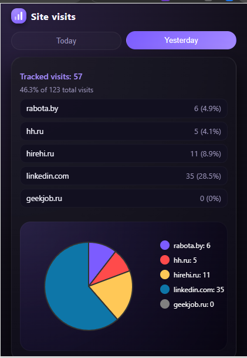

# Site Visits Tracker Chrome Extension · Chrome Extension

A minimal Chrome extension that shows how often you visit selected sites today and yesterday, with a compact dark‑mode chart.

## Overview

**Site Visits Tracker Chrome Extension** is a lightweight Chrome extension that helps you understand how often you visit specific websites during the day.  
It reads your browsing history, counts visits to a configurable list of domains, and visualizes the result in a modern dark popup with a mini pie chart.

## Screenshot

## Features

- Track visits to a custom list of websites.
- Separate stats for **Today** and **Yesterday** (non‑overlapping day ranges).
- Compact dark‑mode popup with a simple SVG pie chart.
- Configurable domains and colors via `config.json`.
- Zero external libraries, works fully offline once installed.

## How it works

- The extension uses the `chrome.history` API to query your browsing history.
- For each day, it counts:
  - the total number of history entries,
  - the number of entries matching each domain from `config.json`.
- The popup shows:
  - total tracked visits and their percentage of all visits for that day,
  - per‑site counts and percentages,
  - a small pie chart and legend for visualizing the distribution.

Daily ranges:

- **Today** – from today 00:00 to the current time.
- **Yesterday** – from yesterday 00:00 to today 00:00.

## Files

manifest.json   – Chrome extension manifest (MV3 configuration).
popup.html      – Dark‑mode popup UI layout and styles.
popup.js        – Logic for loading config, querying history, and rendering stats/chart.
config.json     – List of tracked domains and their chart colors.
icon.png        – Extension icon used in the toolbar and Chrome Web Store.

## Configuration
You can configure which sites are tracked and how they appear in the chart by editing config.json:

domain – domain name to search for in browsing history.
color – hex color used for this site in the pie chart and legend.

Example:
{
  "sites": [
    { "domain": "habr.com",    "color": "#7C5CFF" },
    { "domain": "youtube.com", "color": "#FF4B4B" },
    { "domain": "google.com",  "color": "#FFC857" },
    { "domain": "github.com",  "color": "#3ECF8E" }
  ]
}

## Permissions
This extension requires the following permissions:

history – to read your browsing history and count visits per domain. 

storage – reserved for future use (e.g. storing preferences or custom settings).

No data is sent to any external server; all processing happens locally in your browser. 

## Installation (local development)
Clone this repository:

bash
git clone https://github.com/mawonet/site-visits-tracker-chrome-extension.git
cd site-visits-tracker-chrome-extension
Open chrome://extensions/ in your browser.

Enable Developer mode (toggle in the top‑right corner).

Click Load unpacked and select this project folder.

Pin the extension icon in the toolbar and click it to open the popup.

## Usage
Make sure browsing history is enabled in Chrome (the extension relies on it). 

Visit some of the sites listed in config.json during the day.

Click the extension icon to open the popup.

Use the Today / Yesterday toggle to switch between daily stats.

Adjust the list of tracked domains and their colors in config.json as needed.

## Roadmap / Ideas
Track approximate time spent per domain using tabs / webNavigation events.
Custom date ranges (not only Today / Yesterday).
Export stats to CSV.
Options page to edit tracked sites without touching config.json.

## License
This project is open source and licensed under the MIT License. 